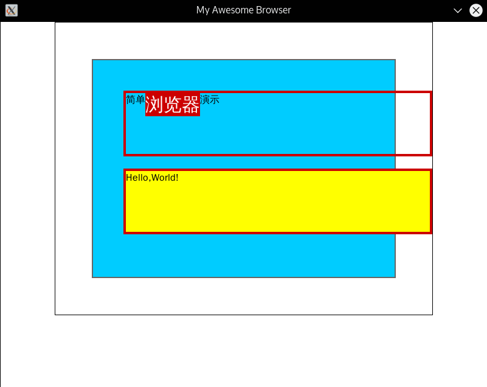

# Overview #

## Introduction ##

This is a project which I developed to learn the mechanism of web browsers. The project contains 5 parts:

1) html parser;

2) css parser;

3) style generator;

4) layout generator;

5) SDL2 painter (named *drawer* in this project);

I mainly take [mbrubeck/robinson](https://github.com/mbrubeck/robinson) as reference when implementing this toy browser.

Each part can be both compiled to a runnable program, or a library linked by others. To compile a runnable program, goto that part and run command:

```
$ make intergrate # compile the runnable program
$ make clean # clean this directory and other dependencies
```
The dependencies are as follows, once again, each part can be run and tested independently.

a) html parser: itself

b) css parser: itself

c) style: html, css

d) layout: style, html, css

e) drawer: layout, style, html, css

Because the browser uses freetype2 for font rendering and SDL2 for painting, SDL2, SDL2_image, freetype2 should be installed first.

## DEMO ##

Let's take testcase/test.html and testcase/test.css as example. 

**The output of htmlprog:**

```
$ ./htmlprog.out ../testcase/test.html
└─<ELEMENT> html
  ├─<ELEMENT> head
  │ └─<ELEMENT> title
  │   └─<TEXT> Test
  └─<ELEMENT> div
    ├─<ELEMENT> p
    │ ├─<TEXT> 简单
    │ ├─<ELEMENT> span
    │ │ └─<TEXT> 浏览器
    │ └─<TEXT> 演示
    
    └─<ELEMENT> p
      └─<TEXT> Hello, World!
```
**The output of css:**
```
$ ./cssprog.out ../testcase/test.css
├─span
│  └─display: inline
├─html
│  ├─width: 600.000000px
│  ├─padding: 10.000000px
│  ├─border-width: 1.000000px
│  ├─border-color: 0 0 0 255
│  ├─margin: auto
│  └─background: 255 255 255 255
├─head
│  └─display: none
├─.outer
│  ├─background: 0 204 255 255
│  ├─border-color: 102 102 102 255
│  ├─border-width: 2.000000px
│  ├─margin: 50.000000px
│  └─padding: 50.000000px
├─.inner
│  ├─border-color: 204 0 0 255
│  ├─border-width: 4.000000px
│  ├─height: 100.000000px
│  ├─margin-bottom: 20.000000px
│  └─width: 500.000000px
├─#bye .inner
│  └─background: 255 255 0 255
└─#name span
   ├─background: 204 0 0 255
   ├─color: 255 255 255 255
   └─font-size: 30.000000px
```
**The output of style:**
```
$ ./styleprog.out ../testcase/test.html ../testcase/test.css
└─<ELEMENT> html
  background: 255 255 255 255
  border-color: 0 0 0 255
  border-width: 1.000000px
  margin: auto
  padding: 10.000000px
  width: 600.000000px
  ├─<ELEMENT> head
  │ display: none
  │ └─<ELEMENT> title
  │   └─<TEXT> Test
  │     height: 21.000000px
  │     width: 30.000000px
  └─<ELEMENT> div
    background: 0 204 255 255
    border-color: 102 102 102 255
    border-width: 2.000000px
    margin: 50.000000px
    padding: 50.000000px
    ├─<ELEMENT> p
    │ border-color: 204 0 0 255
    │ border-width: 4.000000px
    │ height: 100.000000px
    │ margin-bottom: 20.000000px
    │ width: 500.000000px
    │ ├─<TEXT> 简单
    │ │ height: 21.000000px
    │ │ width: 32.000000px
    │ ├─<ELEMENT> span
    │ │ background: 204 0 0 255
    │ │ color: 255 255 255 255
    │ │ display: inline
    │ │ font-size: 30.000000px
    │ │ └─<TEXT> 浏览器
    │ │   color: 255 255 255 255
    │ │   font-size: 30.000000px
    │ │   height: 38.000000px
    │ │   width: 90.000000px
    │ └─<TEXT> 演示
    
    │   height: 21.000000px
    │   width: 52.000000px
    └─<ELEMENT> p
      background: 255 255 0 255
      border-color: 204 0 0 255
      border-width: 4.000000px
      height: 100.000000px
      margin-bottom: 20.000000px
      width: 500.000000px
      └─<TEXT> Hello, World!
    
        height: 21.000000px
        width: 111.000000px
```
**The output of layout:**
```
$ ./layoutprog.out ../testcase/test.html ../testcase/test.css
└─<ELEMENT> html
  INLINE
  content-xywh: 100.000000 11.000000 600.000000 460.000000
  margin-lrtb: 89.000000 89.000000 0.000000 0.000000
  border-lrtb: 1.000000 1.000000 1.000000 1.000000
  padding-lrtb: 10.000000 10.000000 10.000000 10.000000
  └─<ELEMENT> div
    BLOCK
    content-xywh: 202.000000 113.000000 396.000000 256.000000
    margin-lrtb: 50.000000 50.000000 50.000000 50.000000
    border-lrtb: 2.000000 2.000000 2.000000 2.000000
    padding-lrtb: 50.000000 50.000000 50.000000 50.000000
    ├─<ELEMENT> p
    │ BLOCK
    │ content-xywh: 206.000000 117.000000 500.000000 100.000000
    │ margin-lrtb: 0.000000 -112.000000 0.000000 20.000000
    │ border-lrtb: 4.000000 4.000000 4.000000 4.000000
    │ padding-lrtb: 0.000000 0.000000 0.000000 0.000000
    │ └─<ELEMENT> 
    │   ANONYMOUS
    │   content-xywh: 206.000000 117.000000 500.000000 38.000000
    │   margin-lrtb: 0.000000 0.000000 0.000000 0.000000
    │   border-lrtb: 0.000000 0.000000 0.000000 0.000000
    │   padding-lrtb: 0.000000 0.000000 0.000000 0.000000
    │   ├─<TEXT> 简单
    │   │ INLINE
    │   │ content-xywh: 206.000000 117.000000 32.000000 21.000000
    │   │ margin-lrtb: 0.000000 0.000000 0.000000 0.000000
    │   │ border-lrtb: 0.000000 0.000000 0.000000 0.000000
    │   │ padding-lrtb: 0.000000 0.000000 0.000000 0.000000
    │   ├─<ELEMENT> span
    │   │ INLINE
    │   │ content-xywh: 238.000000 117.000000 90.000000 38.000000
    │   │ margin-lrtb: 0.000000 0.000000 0.000000 0.000000
    │   │ border-lrtb: 0.000000 0.000000 0.000000 0.000000
    │   │ padding-lrtb: 0.000000 0.000000 0.000000 0.000000
    │   │ └─<TEXT> 浏览器
    │   │   INLINE
    │   │   content-xywh: 238.000000 117.000000 90.000000 38.000000
    │   │   margin-lrtb: 0.000000 0.000000 0.000000 0.000000
    │   │   border-lrtb: 0.000000 0.000000 0.000000 0.000000
    │   │   padding-lrtb: 0.000000 0.000000 0.000000 0.000000
    │   └─<TEXT> 演示
    
    │     INLINE
    │     content-xywh: 328.000000 117.000000 52.000000 21.000000
    │     margin-lrtb: 0.000000 0.000000 0.000000 0.000000
    │     border-lrtb: 0.000000 0.000000 0.000000 0.000000
    │     padding-lrtb: 0.000000 0.000000 0.000000 0.000000
    └─<ELEMENT> p
      BLOCK
      content-xywh: 206.000000 245.000000 500.000000 100.000000
      margin-lrtb: 0.000000 -112.000000 0.000000 20.000000
      border-lrtb: 4.000000 4.000000 4.000000 4.000000
      padding-lrtb: 0.000000 0.000000 0.000000 0.000000
      └─<ELEMENT> 
        ANONYMOUS
        content-xywh: 206.000000 245.000000 500.000000 21.000000
        margin-lrtb: 0.000000 0.000000 0.000000 0.000000
        border-lrtb: 0.000000 0.000000 0.000000 0.000000
        padding-lrtb: 0.000000 0.000000 0.000000 0.000000
        └─<TEXT> Hello, World!
    
          INLINE
          content-xywh: 206.000000 245.000000 111.000000 21.000000
          margin-lrtb: 0.000000 0.000000 0.000000 0.000000
          border-lrtb: 0.000000 0.000000 0.000000 0.000000
          padding-lrtb: 0.000000 0.000000 0.000000 0.000000
```
**The output of drawer:**
